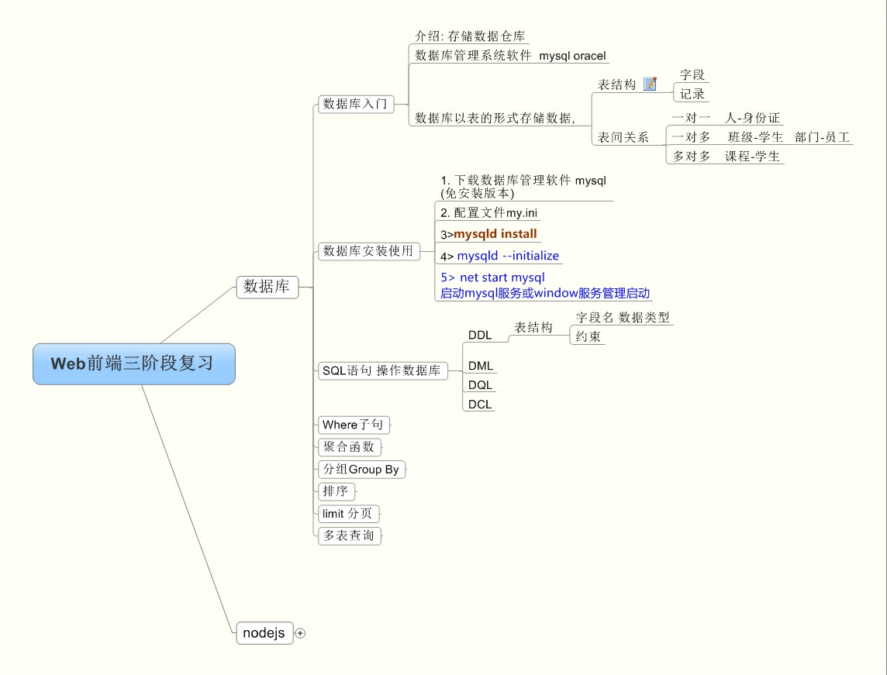
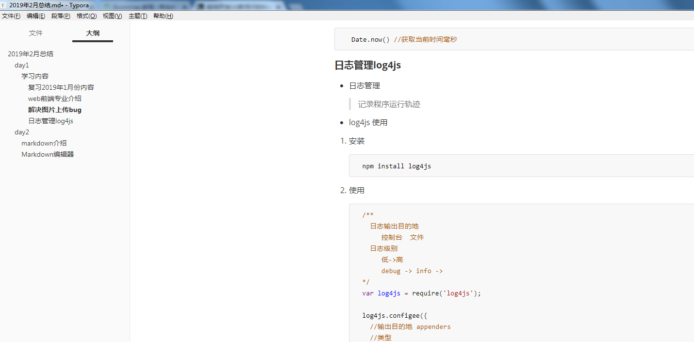
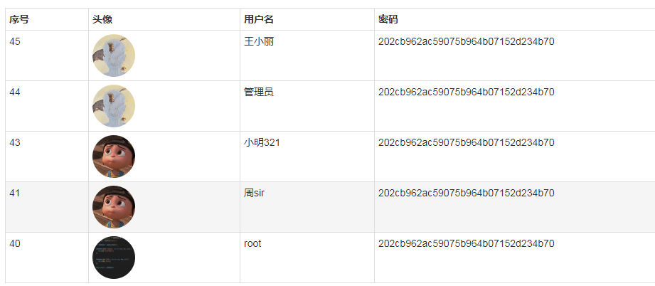
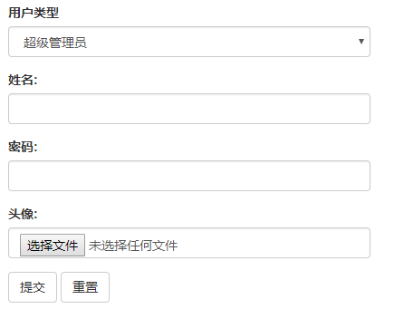
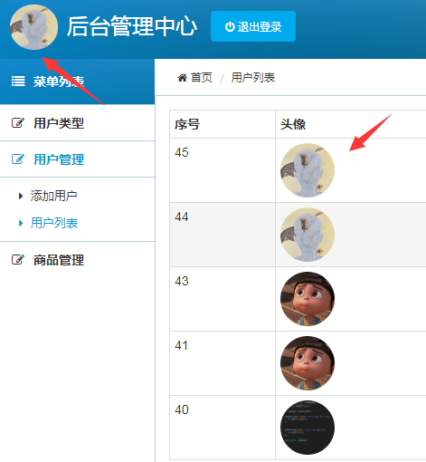
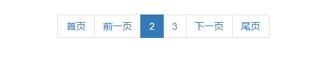

# 2019年2月总结
## day1
### 学习内容
- 复习2019年1月份内容
- web前端专业介绍
- 解决图片上传bug
- 日志管理log4js

### 复习2019年1月份内容 


### web前端专业介绍
- 什么是web前端
- 为什么学习web前端
- 技能要求
### 解决图片上传bug
```javascript
  Date.now() //获取当前时间毫秒
```
### 日志管理log4js
- 日志管理
   > 记录程序运行轨迹
- log4js 使用
1. 安装 
	npm install log4js
2. 使用
```javascript
/**
 日志输出目的地  
  控制台  文件
    日志级别
    低->高
     debug -> info -> 
 */
 var log4js = require('log4js');
   
 log4js.configee({
 //输出目的地 appenders
  //类型
 });
   
 var logger = log4js.getLogger();
  logger.debug('日志信息');
```
3. express集成

## day2
### 学习内容
1. markdown介绍
2. bootstrap框架
### markdown介绍
> Markdown 是 2004 年由 John Gruberis 设计和开发的纯文本格式的语法，非常的简单实用。
#### Markdown编辑器
1. Typora

下载地址:https://www.typora.io/
2. Markdown pad
> 用户可以通过键盘快捷键和工具栏按钮来使用或者移除 Markdown 格式。MarkdownPad左右栏的分割方式令用户可以实时看到 HTML 格式的 Markdown 文档。 

下载地址： http://markdownpad.com/

### bootstrap框架
> Bootstrap 是最受欢迎的 HTML、CSS 和 JS 框架，用于开发响应式布局、移动设备优先的 WEB 项目。
1. 响应式框架
2. 全局 CSS 样式
   > 设置全局 CSS 样式；基本的 HTML 元素均可以通过 class 设置样式并得到增强效果；还有先进的栅格系统。
3. JavaScript 插件
   > jQuery 插件为 Bootstrap 的组件赋予了“生命”。可以简单地一次性引入所有插件，或者逐个引入到你的页面中。
4. 组件
   > 无数可复用的组件，包括字体图标、下拉菜单、导航、警告框、弹出框等更多功能。

#### 全局 CSS 样式使用
1. Bootstrap 表格
   

2. Bootstrap 表单
```javascript
  <form role="form"  action="/add.do" method="post" enctype="multipart/form-data">
            <div class="form-group">
                <label>用户类型</label>
                <select name='typeid' class="form-control">
                    <option value="">管理员</option>
                </select>
            </div>
            <div class="form-group">
                <label>姓名:</label>
                <input id="clientname" type="text" name="clientname" class="form-control">
            </div>
  
            <div class="form-group">
                <label>密码:</label>
                <input id="password" type="password" name="password" class="form-control">
            </div>
  
            <div class="form-group">
                <label>头像:</label>
                <input type="file" name="headerimg" class="form-control">
            </div>
  
            <input type="submit" value="提交" class="btn btn-default">
            <input type="reset" value="重置" class="btn btn-default">
     </form>
```
  

3. Bootstrap 按钮
```javascript
   <!-- 标准的按钮 -->
   <button type="button" class="btn btn-default">默认按钮</button>
   <!-- 提供额外的视觉效果，标识一组按钮中的原始动作 -->
   <button type="button" class="btn btn-primary">原始按钮</button>
   <!-- 表示一个成功的或积极的动作 -->
   <button type="button" class="btn btn-success">成功按钮</button>
   <!-- 信息警告消息的上下文按钮 -->
   <button type="button" class="btn btn-info">信息按钮</button>
   <!-- 表示应谨慎采取的动作 -->
   <button type="button" class="btn btn-warning">警告按钮</button>
   <!-- 表示一个危险的或潜在的负面动作 -->
   <button type="button" class="btn btn-danger">危险按钮</button>
   <!-- 并不强调是一个按钮，看起来像一个链接，但同时保持按钮的行为 -->
   <button type="button" class="btn btn-link">链接按钮</button>
```


4. Bootstrap 图片

```javascript
      
```

#### JavaScript 插件
1. 分页插件pagination

```javascript
<div style="width:900px;margin: 0 auto;">
    <ul class="pagination" id="pagination"></ul>
</div>

<script src="js/jquery.js" type="text/javascript"></script>
<script type="text/javascript" src="js/jqPaginator.js"></script>
<script type="text/javascript">
     var currentNo = '<%= currentPage %>';
     currentNo = parseInt(currentNo);
     var pageCount = ' <%= pageCount %> ';
     pageCount = parseInt(pageCount);

     $.jqPaginator('#pagination', {
            totalPages: pageCount,
            visiblePages: 2,
            currentPage: currentNo,
            first: '<li class="first"><a href="javascript:void(0);">首页</a></li>',
            prev: '<li class="prev"><a href="javascript:;">前一页</a></li>',
            next: '<li class="next"><a href="javascript:void(0);">下一页</a></li>',
            last: '<li class="last"><a href="javascript:void(0);">尾页</a></li>',
            page: '<li class="page"><a href="javascript:;">{{page}}</a></li>',
            onPageChange: function (num, type) {
                if (type == 'change') {
                    //这里是点击分页的回调
                    window.location.href = 'list.do?pageNo=' + num;
                }
            }
        });
    </script>
```

